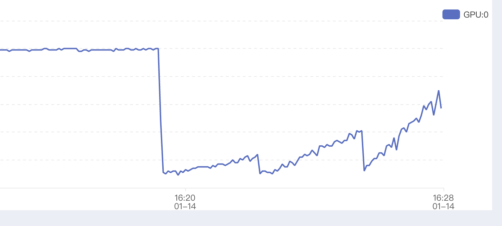

# nano-vllm-learn
# 特点
1. 详细的注释，方便学习
2. without-flash-attn的实现：我觉得flash-attn在最开始安装环境时候时候需要编译比较花时间，就想做一个wo-flash-attn的版本。main分支已经合并了完整实现，并且改了bench，下面说；wo_flash_attn分支记录了开发过程。
3. 改了一个小BUG：原来的block_manager没有考虑过短prompt=1触发assert error的情况，新增了一个补偿逻辑。

## Bugfix：warmup 短 prompt 触发 block_manager 断言
- 现象：跑 `bench_my.py` 时 warmup 阶段崩在 `assert last_block.hash != -1`（`may_append` 的 `%block_size==1` 分支）。
- 根因：warmup prompt 很短（通常 1~几 token），`allocate` 不会给未满块写 hash；decode 时 `len%block_size==1` 依然会调 `may_append`，原断言误以为上一块必须已有 hash。
- 方案：在进入 `%block_size==1` 分支时，如果上一块尚未写 hash，就补偿计算（只有块满才写）。对合法的短序列不再断言中断。

## Triton 实现的 Flash-Attention V2

FA v1 和 v2 的核心区别（论文总结）：

1.	减少 non-matmul FLOPs（例如改写输出更新形式、只存 logsumexp 等） 
2.	沿 sequence length（query 维度）增加并行度，长序列小 batch/小头数时也能把 SM 吃满 
3.	block 内 warp 分工更合理，减少 shared-memory 读写和同步（提升吞吐） 

这里是online-softmax的伪代码实现，可以看到：

* 外层固定 Q block ⇒ 这个 block 的 $Q_i、running m_i,\ell_i$、以及输出累加器 $O_i$ 可以在片上持续存在
* 内层扫所有 K/V blocks ⇒ 只需不断流式加载 K/V tiles，更新这一个 $O_i$（在paged-attn中，kv是分块的，需要从block-table中计算出实际的物理位置然后拿到）
* 最终把 $O_i$ 写回 HBM 一次，避免 FA1 “每个 KV tile 都要把 $O_i$ 读写回HBM“ 的高延迟操作。

```
# 初始化累积器
acc = tl.zeros([head_dim], dtype=tl.float32)  # 加权和
l_i = 0.0                                       # 归一化因子
m_i = -1e10                                     # 最大值跟踪

# 对每个chunk处理
for chunk_idx in range(max_chunks):
    # 计算当前chunk的注意力分数
    qk = compute_attention_scores(q, k_chunk)
    
    # 在线softmax更新
    m_ij = tl.max(qk)
    m_i_new = tl.maximum(m_i, m_ij)
    alpha = tl.exp(m_i - m_i_new)
    
    # 重新缩放累积器
    acc = acc * alpha
    l_i = l_i * alpha
    
    # 加权累积V向量
    acc = acc + sum(p * v_chunk)
    l_i = l_i + sum(p)

# 循环结束后再做一次归一化和写回，减少非 mm 计算和写 HBM 的次数
output = acc / l_i
store(output)
```

写了一个小脚本：[`flash_attention_example.py`](flash_attention_example.py)

（旧版“SDPA 替代 flash-attn”的踩坑笔记已移至文末“开发记录（存档）”。）

## 删除official bench的随机性，添加命令行参数`--attn-backend`
我修改了[official bench代码](bench.py)的随机性，原来他的代码是定下一个max-input-len和max-output-len，然后`randint(100, max)`随机取输入输出长度，我觉得还是定下来我比较安心，就把randint删掉了。

同时新增了`--attn-backend`的命令行参数，用来指定使用sdpa、triton、flash，默认是flash（flash-attention）。

跑下来结果：

```
(nano_venv) root@autodl-container-b95c4d8452-4b3d06c8:~/workspace/nano-vllm-learn# python bench.py --attn-backend flash
`torch_dtype` is deprecated! Use `dtype` instead!
Total: 262144tok, Time: 64.33s, Throughput: 4075.22tok/s
(nano_venv) root@autodl-container-b95c4d8452-4b3d06c8:~/workspace/nano-vllm-learn# python bench.py --attn-backend sdpa
`torch_dtype` is deprecated! Use `dtype` instead!
Total: 262144tok, Time: 64.34s, Throughput: 4074.61tok/s
```

## 表格对比功能 bench_my.py

为了更系统地比较不同 attention 后端在 **decode 吞吐**上的差异，我写了一个表格版的 bench：[`bench_my.py`](bench_my.py)。

它的特点：
- **一次跑三种后端**：`flash` / `triton` / `sdpa.math`（用 `--attn-backend` 传 list）。
- **一次跑多组 batch size + 多组长度**：用 `--batch-sizes` 和 `--input-lens` 传 list。
- **只统计 output token 的吞吐（tok/s）**：忽略 prefill token，把 `output_len` 固定为 `input_len`，方便横向对比 decode 性能。

默认配置（不加参数直接跑）：
- `--attn-backend flash triton sdpa.math`
- `--batch-sizes 16 32 64`
- `--input-lens 512 1024 2048`（并且 `output_len=input_len`）

示例：
```bash
python bench_my.py \
  --attn-backend flash triton sdpa.math \
  --batch-sizes 16 32 64 \
  --input-lens 512 1024 2048 \
  --max-model-len 4096
```

注意事项：
- 由于我们把 `output_len` 固定为 `input_len`，所以需要满足 `2*max(input_lens) <= max_model_len`，否则脚本会直接报错提醒你调参。
- 表格里显示的 `OOM` 表示该组合在当前 GPU/显存配置下跑不动（常见于大 batch + 长序列）。


# bench

## sdpa.math < triton < flash

简单的对比（bench.py）：

```
(nano_venv) root@autodl-container-b95c4d8452-4b3d06c8:~/workspace/nano-vllm-learn# python bench.py --attn-backend sdpa
`torch_dtype` is deprecated! Use `dtype` instead!
Total: 65536tok, Time: 296.42s, Throughput: 221.09tok/s
(nano_venv) root@autodl-container-b95c4d8452-4b3d06c8:~/workspace/nano-vllm-learn# python bench.py --attn-backend triton
`torch_dtype` is deprecated! Use `dtype` instead!
Total: 65536tok, Time: 38.37s, Throughput: 1708.14tok/s
(nano_venv) root@autodl-container-b95c4d8452-4b3d06c8:~/workspace/nano-vllm-learn# python bench.py --attn-backend flash
`torch_dtype` is deprecated! Use `dtype` instead!
Total: 65536tok, Time: 16.04s, Throughput: 4085.22tok/s
```

更加全面的对比（bench_my.py)：

```
================================================================================
CROSSOVER ANALYSIS (tok/s, output_len=input_len)
================================================================================
Batch Size 1   |        flash |       triton |    sdpa.math
-----------------------------------------------------------
       512 |          402 |           61 |           18
      1024 |          397 |           32 |           19
      2048 |          369 |           16 |           18

Batch Size 2   |        flash |       triton |    sdpa.math
-----------------------------------------------------------
       512 |          716 |          116 |           34
      1024 |          687 |           62 |           34
      2048 |          609 |           33 |           34

Batch Size 4   |        flash |       triton |    sdpa.math
-----------------------------------------------------------
       512 |         1305 |          231 |           69
      1024 |         1215 |          125 |           69
      2048 |          967 |           65 |           69

Batch Size 8   |        flash |       triton |    sdpa.math
-----------------------------------------------------------
       512 |         2377 |          460 |          139
      1024 |         1925 |          247 |          141
      2048 |         1385 |          129 |          108

Batch Size 16  |        flash |       triton |    sdpa.math
-----------------------------------------------------------
       512 |         3574 |          885 |          279
      1024 |         2670 |          482 |          209
      2048 |         1715 |          252 |          113

Batch Size 32  |        flash |       triton |    sdpa.math
-----------------------------------------------------------
       512 |         5318 |         1719 |          388
      1024 |         3541 |          935 |          217
      2048 |         2132 |          489 |          OOM

Batch Size 64  |        flash |       triton |    sdpa.math
-----------------------------------------------------------
       512 |         6583 |         3089 |          OOM
      1024 |         4076 |         1693 |          OOM
      2048 |         2099 |          489 |          OOM
```

这里也有一张bsz增大，GPU利用率爬升的图，慢慢变成compute-bound



## sdpa vs flash（没有可比性）

```
(nano_venv) root@autodl-container-b95c4d8452-4b3d06c8:~/workspace/nano-vllm-learn# python bench_my.py --attn-backend flash sdpa
`torch_dtype` is deprecated! Use `dtype` instead!
^[[A^[[B
================================================================================
CROSSOVER ANALYSIS
================================================================================
 Input Len |  Flash (ms) |    Flash tp |  SDPA (ms) |    SDPA tp |   Winner |  Speedup
------------------------------------------------------------------------------------------------
       512 |    3075.008 |        5328 |  42203.928 |        388 |    Flash |   13.72x
      1024 |    4267.898 |        3839 |  64877.147 |        253 |    Flash |   15.20x
      1536 |    5468.262 |        2996 |  88115.733 |        186 |    Flash |   16.11x
      2048 |    6651.592 |        2463 | 111999.628 |        146 |    Flash |   16.84x
      2560 |    7869.468 |        2082 | 136555.871 |        120 |    Flash |   17.35x
      3072 |    9091.268 |        1802 | 161280.169 |        102 |    Flash |   17.74x
      3584 |   10328.921 |        1586 | 186514.650 |         88 |    Flash |   18.06x
```

# 为什么必须做triton paged attn？

## 原来的做法：SDPA设计要求组连续的大buffer，失去了paged-attn的意义，必然爆

Eager没有OOM的原因是：在attention_sdpa.py代码里，decode分支且传入block-table的情况下，会对所有kvcache组一个dense buffer，max_seq_len = max_blocks * block_size，然后用 flat_idx = block_ids * block_size + offset 去从整块 KV cache 里 gather 出一个 [B, S, num_kv_heads, head_dim] 的 dense buffer。这一点很吃显存，所以会OOM崩掉。bench_my.py里decode长度只有512，不会OOM；而bench.py里，decode长度是1024，会OOM。

没有OOM是建立在 start with "sdpa" enforce-eager的情况下的。只要删掉了这个设定，让sdpa.math在decode时候走cudagraph，不管config调整多小都报错OOM。保留sdpa.math作为baseline分支。

sdpa.math使用eager，用bench.py在bsz=64，input=1024，output=512情况下跑出来：
```
(nano_venv) root@autodl-container-b95c4d8452-4b3d06c8:~/workspace/nano-vllm-learn# python bench.py --attn-backend sdpa.math
Total: 32768tok, Time: 127.40s, Throughput: 257.21tok/s
(nano_venv) root@autodl-container-b95c4d8452-4b3d06c8:~/workspace/nano-vllm-learn# python bench.py --attn-backend flash
Total: 32768tok, Time: 7.33s, Throughput: 4468.50tok/s
```

## 现在的做法：Prefill 阶段：使用自定义 Triton FlashAttention（适合连续 buffer）；Decode 阶段：使用 Triton 实现的 Paged-Attention（避免 SDPA 的内存连续化问题）

| 阶段   | 做法 | 关键点 |
| --- | --- | --- |
| Prefill | 自定义 Triton FlashAttention（varlen） | 连续 buffer，方便捕获/复用，避免 SDPA 的 graph 限制 |
| Decode | Triton Paged-Attention | 直接用 block-table 定位物理块，不做 dense buffer，显存开销随 BLOCK_N 而非全长 |
| SDPA（baseline） | 需要把 KV 连续化后再喂 SDPA | 会组 [B, S, H, D] 大 buffer，长序列 OOM，且 Graph 捕获下易炸 |

**核心代码片段：paged-attn 如何从 block-table 拿 KV（摘自 `nanovllm/layers/attention_triton.py`）**

```python
# 关键：按 chunk 处理，每次只看 BLOCK_N 个 token
max_chunks = tl.cdiv(max_num_blocks * block_size, BLOCK_N)
for chunk_idx in range(max_chunks):
    token_start = chunk_idx * BLOCK_N
    if token_start < context_len:
        offs_n = token_start + tl.arange(0, BLOCK_N)
        mask_n = offs_n < context_len

        # 计算逻辑 block 号和块内偏移
        block_num = offs_n // block_size
        block_offset = offs_n % block_size

        # block-table → 物理块 id
        block_table_offset = batch_idx * max_num_blocks + block_num
        physical_block_idx = tl.load(block_tables_ptr + block_table_offset)

        # 直接从分页 KV cache 读 K/V（无需连续化）
        k_offset = (
            physical_block_idx * block_size * num_kv_heads * head_dim
            + block_offset * num_kv_heads * head_dim
            + kv_head_idx * head_dim
            + offs_d
        )
        k_vec = tl.load(k_cache_ptr + k_offset)   # K
        # ... 计算 qk / online-softmax ...
        v_offset = (...)  # 同上拼出 V 的物理地址
        v_vec = tl.load(v_cache_ptr + v_offset)   # V
        # acc = acc + weight * v_vec
```

要点：不组大 buffer；逻辑索引通过 block-table 映射到物理 KV block，按 chunk 做在线 softmax，显存只与 BLOCK_N 成正比。

| 内存/访问 | SDPA（dense buffer） | Triton paged-attn |
| --- | --- | --- |
| 单次临时分配 | `2 × B × S × H × D`（会随 max_seq_len 爆炸，OOM 根源） | `BLOCK_N × H × D`（与序列总长无关） |
| 访问模式 | 先 gather 出连续 [B, S, H, D] 再计算 | 直接用 block-table 定位物理块，边取边算，无 gather |

内存使用对比（假设 Batch=32, Max_seq_len=4096, Heads=32, Head_dim=128，fp16）：

| 实现  | 内存消耗                                   | OOM 风险 |
| --- | -------------------------------------- | --- |
| SDPA | `2 × 32 × 4096 × 32 × 128 × 2 bytes ≈ 2GB` | ❌ 极高 |
| Triton | `2 × BLOCK_N × 32 × 128 × 2 bytes`（BLOCK_N=64 → ≈16KB） | ✅ 极低 |


# Future Plan(nano-moe coming soon)

因为一直在研究moe推理优化，所以想在nanovllm上实现下面这几个特性，把这个仓库慢慢转变成`nano-moe`哈哈哈😄：

-[ ] 支持dpsk-moe

  - [ ] Nano vllm triton mla

  - [ ] Nano vllm triton moe kernel fusion  https://zhuanlan.zhihu.com/p/21251657579

- [x] Nano vllm triton paged-attn

- [ ] Nano vllm eplb

- [ ] Nano vllm shared-expert-overlap

# 开发记录（存档）：SDPA 替代 flash-attn 的踩坑
* 主要工作量：从 block-tables 找到对应 kvcache，再喂给 SDPA。
* 与 CUDA graph 的兼容问题（commit: https://github.com/ztxdcyy/nano-vllm-learn/commit/2f1a0ae2df9f7729494c5c70caf010dd786d2b5e）：
  1) 捕获 graph 禁止 host 操作，原本的 tolist/item 需移除。
  2) 捕获 graph 的 dummy input 会有 `context_lens=torch.zeros(...)`，老断言 `max_seq_len>0` 会冲突，改成更鲁棒的判断。
* 后端传递踩坑：模型只读 Qwen3Config（hf_config），不读运行时 Config。必须把自定义 `attn_backend` 写进 hf_config，否则始终跑 flash-attn（attn_sdpa.py 不会被用到）。
