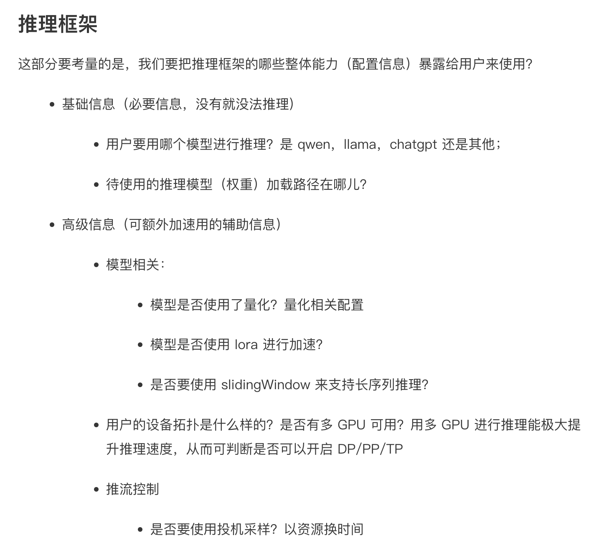

- [ ] 把flash-attn换成torch.sdpa，不然又要编译flashattn太麻烦了跑不起来
- [ ] 写一个requirements.txt方便pip环境配置
- [ ] kvcache 驱逐策略LRU

# 数据流向

```
graph TD
    A[用户请求] --> B[LLMEngine.generate]
    B --> C[add_request]
    C --> D[Sequence对象创建]
    D --> E[Scheduler等待队列]
    
    F[主循环] --> G[step方法]
    G --> H[Scheduler调度]
    H --> I[ModelRunner推理]
    I --> J[后处理更新]
    J --> K[进度条更新]
```

1. example.py 初始化llm
    1.1 定义一个推理引擎类 LLM -> LLMEngine
    1.2 组织sampling_params和prompt beam search（选取综合概率最高的topk序列）【params = BeamSearchParams(beam_width=5, max_tokens=50)】
    1.3 生成模型结果：调用llm_engine的generate方法
2. llm来自于llm_engine。LLM作为llm_engine的封装，隐藏了底层实现，同时后续加功能也更方便。对于vllm，实现了一些特性：tensor_parallel_size、quantization、gpu_memory_utilization（包含了weight、activation、kvcache，显存利用率高的时候可以放更多kvcache从而提高模型吞吐，但是可能造成OOM）
3. llm_engine 推理引擎
设计推理框架的时候需要考虑暴露给用户的能力（接口）


# LLMEngine
LLMEngine 可以简单分别三个部分，scheduler、block manager、module_runner
1. scheduelr：类似于交警，负责指挥交通。负责 prompt 的调度，即针对用户输入的众多 prompts，选出可以使得吞吐最大的那些 prompts 进行调度
2. block manager：管仓库的，负责安排内存（blocks、slots）
3. modle_runner：实际负责计算的模块。在通过 schedule 确定哪些 prmopt 需要调度时，真正执行一个模型的推理。

## 代码拆解

### [Generate](nanovllm/engine/llm_engine.py)
1. 创建采样参数sp，打包sp和prompt创建序列seq
2. 执行**核心循环step**，返回output和num_tokens
```    
def step(self):
        # 调用调度器的schedule方法，返回seqs和is_prefill
        seqs, is_prefill = self.scheduler.schedule()
        token_ids = self.model_runner.call("run", seqs, is_prefill)
        self.scheduler.postprocess(seqs, token_ids)
        outputs = [(seq.seq_id, seq.completion_token_ids) for seq in seqs if seq.is_finished]
        num_tokens = sum(len(seq) for seq in seqs) if is_prefill else -len(seqs)
        return outputs, num_tokens
```
具体调度器过程放在后面分析


### TP
使用spawn启动多进程，spawn采用pickle复制的方式传递父进程的参数状态等，每个子进程是独立的 Python 解释器，不会继承父进程的 CUDA 状态，避免 fork 带来的 bug。（所以启动TP的时候，ps看进程的时候可以看到一大堆python.multiprocessing.spawn，原来如此。）
[Python多进程：spawn and fork](python_multiprocessing.md)

* init这里，初始化config、使用torch.multiprocessing启动多进程，注册model_runner（在主进程上，指定了0）`self.model_runner = ModelRunner(config, 0, self.events)`，注册调度器`self.scheduler = Scheduler(config)`

* add_request：首先注意到这里prompt可以是字符串也可以是list[int]，前者很好理解，就是在example.py里的`    prompts = [
        "introduce yourself",
        "list all prime numbers within 100",
    ]`，当传入字符串时候，需要通过tokenizer做embedding得到token ID 列表。后者就是当你传入一个token ID 列表的时候，直接使用这个列表。**【但是这里比较疑问🤔，啥时候会直接传入这个列表呢？】**

### [Sequence](nanovllm/engine/sequence.py)

1. 状态机：WAITING/RUNNING/FINISHED
2. block_table：管理kvcache
3. 装饰器作用： @property：将方法转换为只读属性，调用时不需要加括号`outputs = [(seq.seq_id, seq.completion_token_ids) for seq in seqs if seq.is_finished]
`比如这里的`seq.is_finished`就没有加括号（本身无参数函数得弄一个空着的括号，现在用了装饰器就不用了）
4. 方法：
    1. append_token：用于流式生成的时候，将tokenid追加到列表中，更新最后一个token这个属性，以及更新num_tokens。在schduler中调用`seq.append_token(token_id)`
    2. __getstate__看不懂__setstate__看不懂
    3. `if self.num_completion_tokens == 0:`判读当前seq在prefill还是在deocde阶段。prefill的话就传token_ids列表，需要计算完整的prompt，decode的话就传最后一个token，前面的prompt已经算出来kvcache了就不用再算了。

```
# Prefill阶段示例
prompt = "中国的首都是"
sequence = Sequence([中, 国, 的, 首, 都, 是])
# __getstate__ 传输: [中, 国, 的, 首, 都, 是] (完整序列)

# Decode阶段示例
sequence.append_token(北)  # 生成第一个token
sequence.append_token(京)  # 生成第二个token
# __getstate__ 传输: 京 (仅最后一个token)
```


# [Scheduler](nanovllm/engine/scheduler.py)

## 分析

## 代码拆解


